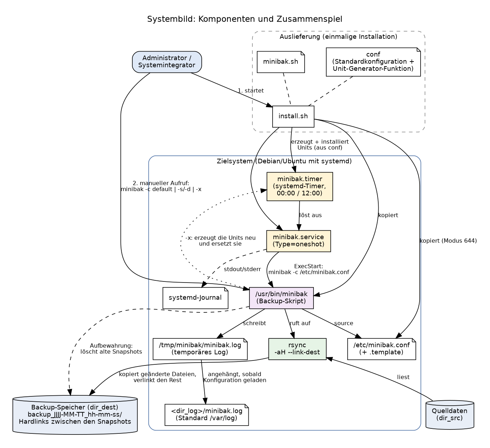
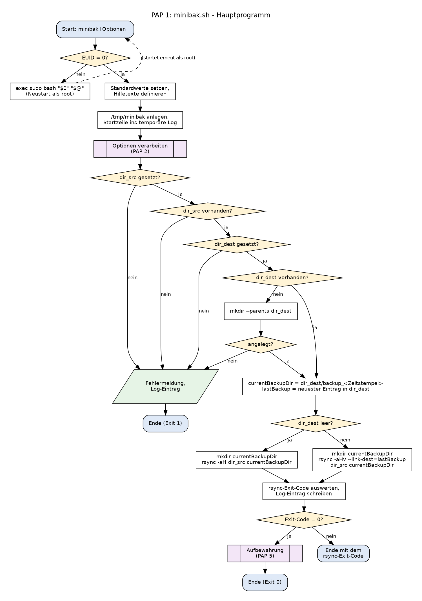
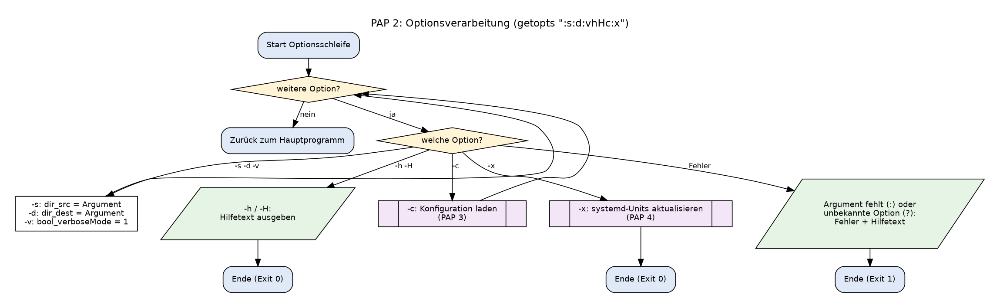
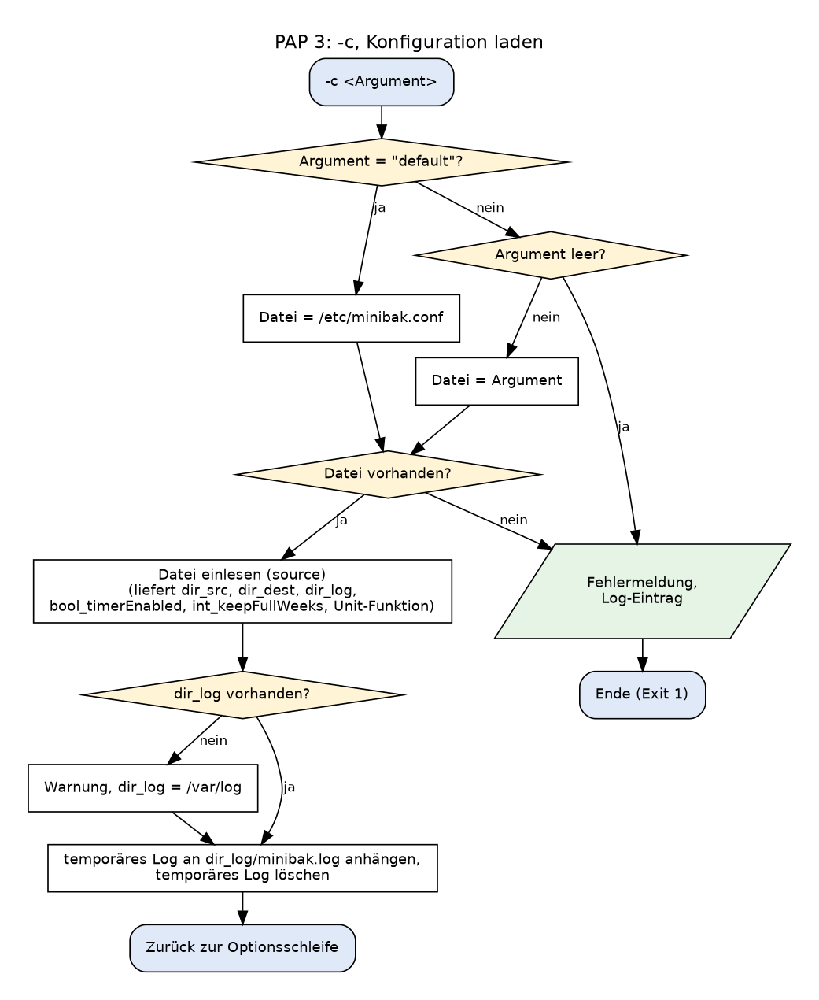
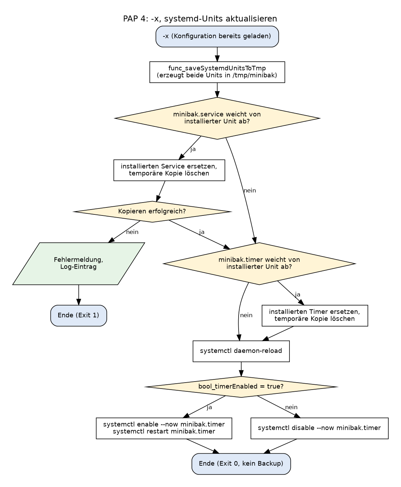
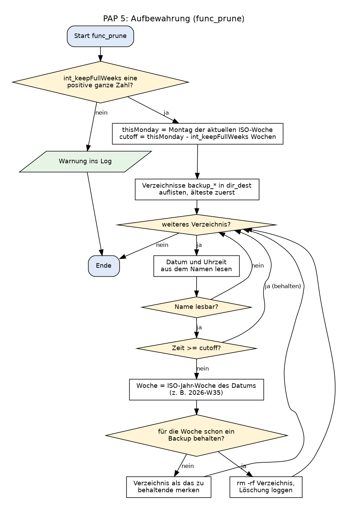
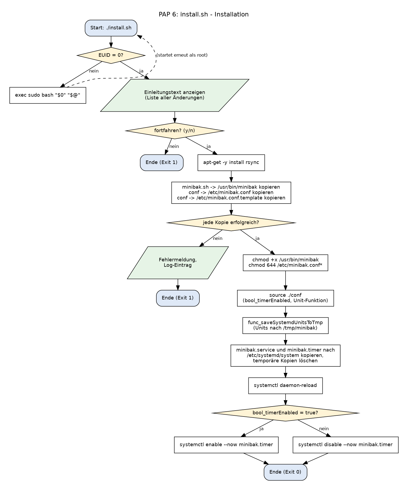
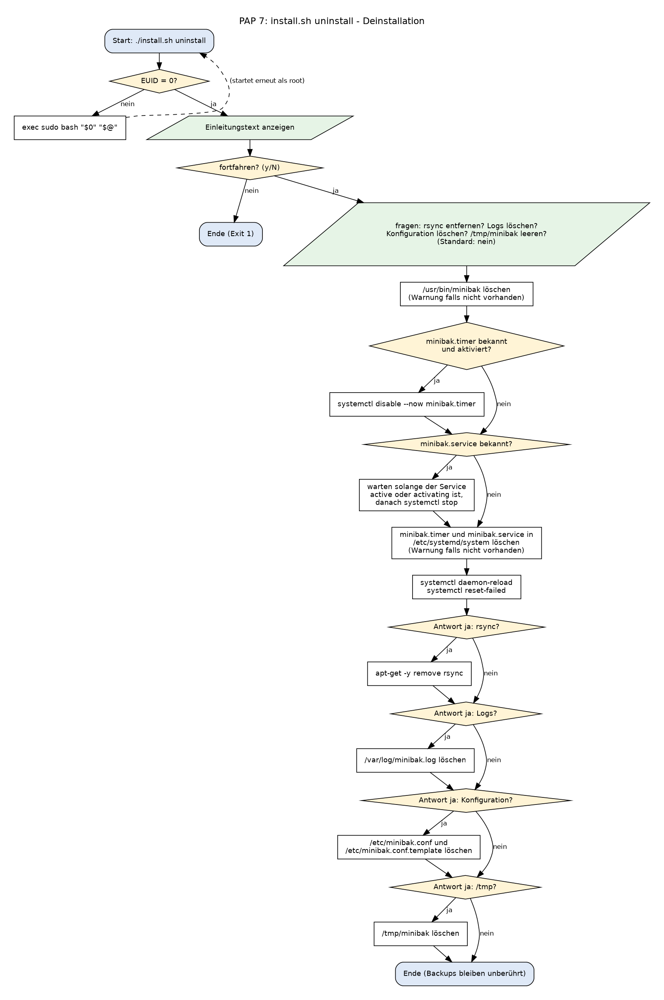

# Minibak – inkrementelles Backup mit rsync und systemd

> Dokumentation für IT-Fachleute · [English version](README.md) · [Kurzanleitung zur Installation](INSTALL.de)

## Inhalt

1. [Produktbeschreibung](#1-produktbeschreibung)
2. [Systembeschreibung](#2-systembeschreibung)
   1. [Systemübersicht](#21-systemübersicht)
   2. [Installierte Dateien und Verzeichnisse](#22-installierte-dateien-und-verzeichnisse)
   3. [Komponenten](#23-komponenten)
   4. [Ablaufpläne](#24-ablaufpläne-pap)
   5. [Entwurfsentscheidungen](#25-entwurfsentscheidungen)
3. [Quelltexte](#3-quelltexte)
4. [Kundendokumentation: Installation und Bedienung](#4-kundendokumentation-installation-und-bedienung)
5. [Test und Verifikation](#5-test-und-verifikation)
6. [Fazit](#6-fazit)
7. [Anhang: Quelltexte](#anhang-quelltexte)

---

## 1. Produktbeschreibung

Minibak ist ein kleines, in Bash geschriebenes Backup-Werkzeug für Debian/Ubuntu. Es kopiert ein Verzeichnis in Snapshots mit Zeitstempel, läuft zeitgesteuert und räumt alte Snapshots selbstständig auf.

- **Inkrementelle Snapshots:** Jeder Lauf erzeugt ein neues Verzeichnis `backup_JJJJ-MM-TT_hh-mm-ss`. Unveränderte Dateien werden per Hardlink auf den vorherigen Snapshot verwiesen (`rsync --link-dest`). Jeder Snapshot ist dadurch eine vollständige, direkt durchsuchbare Kopie, die nur den Platz der geänderten Dateien kostet.
- **Zeitgesteuert:** Ein systemd-Timer startet das Backup (Standard: 00:00 und 12:00 Uhr). Der Zeitplan ist an genau einer Stelle definiert, der Konfigurationsdatei.
- **Automatische Aufbewahrung:** Alle Backups der aktuellen und der letzten vier Kalenderwochen bleiben erhalten (einstellbar); ältere werden auf ein Backup pro Woche ausgedünnt.
- **Eine Konfigurationsdatei** (`/etc/minibak.conf`), alternativ Kommandozeilenoptionen.
- **Installer und Deinstaller** mit Rückfrage, Liste aller Systemänderungen und Logdateien.
- **Logging** mit Stufen (`INFO`, `SUCCESS`, `WARNING`, `ERROR`, `FAILURE`) und aussagekräftigen Exit-Codes.
- **Keine Abhängigkeiten** außer `rsync` und den üblichen GNU-Werkzeugen. Zum Wiederherstellen ist kein Spezialwerkzeug nötig: Ein Snapshot ist ein gewöhnlicher Verzeichnisbaum.

---

## 2. Systembeschreibung

### 2.1 Systemübersicht



| Komponente | Art | Aufgabe |
|---|---|---|
| `install.sh` | Bash-Skript | Installiert/entfernt alles: rsync, Skript, Konfiguration, systemd-Units. Protokolliert in `install.log` / `uninstall.log`. |
| `minibak.sh` → `/usr/bin/minibak` | Bash-Skript | Das Backup-Programm: wertet Optionen aus, lädt die Konfiguration, startet rsync, wertet dessen Exit-Code aus, schreibt das Log, wendet die Aufbewahrungsregeln an und kann die systemd-Units aktualisieren (`-x`). |
| `conf` → `/etc/minibak.conf` | Bash-Fragment | Einstellungen (`dir_src`, `dir_dest`, `bool_timerEnabled`, `dir_log`, `int_keepFullWeeks`) **und** die Funktion, die die beiden systemd-Units erzeugt. |
| `/etc/minibak.conf.template` | Datei | Unveränderte Kopie der Standardwerte zum Zurückfallen. |
| `minibak.timer` | systemd-Timer | Löst um 00:00 und 12:00 Uhr aus und startet den Service. |
| `minibak.service` | systemd-Service (`oneshot`) | Führt je Auslösung einmal `/usr/bin/minibak -c /etc/minibak.conf` aus. Die Ausgabe landet im Journal. |
| `rsync` | externes Programm | Führt das eigentliche Kopieren durch (`-aH`, `--link-dest`). |
| Quelle (`dir_src`) / Backup-Speicher (`dir_dest`) | Verzeichnisse auf Datenträgern | Was gesichert wird und wo die Snapshots liegen. Beide Dateisysteme müssen Hardlinks unterstützen (für `dir_dest`: ein einziges Dateisystem). |
| `/tmp/minibak/` | temporäres Verzeichnis | Temporäres Log und die erzeugten Unit-Dateien. |
| `<dir_log>/minibak.log` | Logdatei | Dauerhaftes Log (Standard `/var/log/minibak.log`). |

**Datenfluss eines zeitgesteuerten Backups**

1. `minibak.timer` löst um 00:00 / 12:00 Uhr aus und startet `minibak.service`.
2. Der Service führt `/usr/bin/minibak -c /etc/minibak.conf` aus.
3. Das Skript liest die Konfiguration, prüft Quelle und Ziel und legt das Verzeichnis `dir_dest/backup_<Zeitstempel>` an.
4. Es ruft `rsync -aH --link-dest=<vorheriger Snapshot> dir_src <neuer Snapshot>` auf. Geänderte Dateien werden kopiert, unveränderte werden zu Hardlinks.
5. Der Exit-Code von rsync wird in einen Log-Eintrag übersetzt. Bei Erfolg entfernt die Aufbewahrungsfunktion nicht mehr benötigte Snapshots.
6. Das Skript endet mit dem Exit-Code von rsync; systemd hält das Ergebnis fest, das Journal die Konsolenausgabe.

### 2.2 Installierte Dateien und Verzeichnisse

| Pfad | Angelegt von | Inhalt |
|---|---|---|
| `/usr/bin/minibak` | `install.sh` | Das Backup-Skript (ausführbar) |
| `/etc/minibak.conf` | `install.sh` | Aktive Konfiguration (Modus 644) |
| `/etc/minibak.conf.template` | `install.sh` | Kopie der Standardkonfiguration (Modus 644) |
| `/etc/systemd/system/minibak.service` | `install.sh` / `minibak -x` | Service-Unit |
| `/etc/systemd/system/minibak.timer` | `install.sh` / `minibak -x` | Timer-Unit |
| `<dir_dest>/backup_JJJJ-MM-TT_hh-mm-ss/<Name von dir_src>/` | `minibak` | Ein Snapshot pro Lauf |
| `<dir_log>/minibak.log` | `minibak` | Dauerhaftes Log |
| `/tmp/minibak/` | beide | Temporäre Dateien, werden zur Laufzeit entfernt oder überschrieben |
| `install.log`, `uninstall.log` | `install.sh` | Im Verzeichnis, aus dem der Installer gestartet wurde |

### 2.3 Komponenten

#### 2.3.1 `minibak.sh` – das Backup-Programm

**Start.** Wird das Skript nicht als root gestartet, ersetzt es sich selbst durch `sudo bash "$0" "$@"`:

```bash
[[ $EUID -ne 0 ]] && exec sudo bash "$0" "$@"
```

Danach werden Standardwerte und Hilfetexte definiert, `/tmp/minibak` angelegt und der Start in ein *temporäres* Log geschrieben. Das dauerhafte Logverzeichnis (`dir_log`) ist erst nach dem Einlesen der Konfiguration bekannt. Deshalb wird zuerst in `/tmp` gesammelt und sofort nach dem Laden der Konfiguration an `<dir_log>/minibak.log` angehängt.

**Optionen** (`getopts ":s:d:vhHc:x"`):

| Option | Bedeutung |
|---|---|
| `-s <dir>`, `-d <dir>` | Quelle und Ziel, Alternative zur Konfigurationsdatei |
| `-c <Datei>` / `-c default` | Konfigurationsdatei laden / `/etc/minibak.conf` laden. Optionen werden von links nach rechts verarbeitet, ein späteres `-s`/`-d` überschreibt also die Konfiguration und umgekehrt. |
| `-x` | Aus der Konfiguration erzeugte Units mit den installierten vergleichen, bei Abweichung ersetzen, systemd neu laden und den Timer je nach `bool_timerEnabled` aktivieren/starten bzw. deaktivieren/stoppen. **Es wird kein Backup erstellt.** `-c` muss davor stehen. |
| `-h`, `-H` | Hilfe / Hilfe zur Konfigurationsdatei |
| `-v` | Reserviert (ausführliche Ausgabe), derzeit ohne Wirkung |

Ein fehlendes Argument oder eine unbekannte Option gibt die Hilfe aus und beendet mit Code 1.

**Backup-Algorithmus.** Nach der Optionsverarbeitung prüft das Skript, ob `dir_src` gesetzt ist und existiert und ob `dir_dest` gesetzt ist (und legt es bei Bedarf an). Dann bildet es den Namen des neuen Snapshots und entscheidet zwischen vollständiger und inkrementeller Kopie:

```bash
if [[ -z "$(ls $dir_dest)" ]]
	then
		echo "No previous backups found"
		echo "$(date +"%Y-%m-%d %H:%M:%S:%N") [INFO] No previous backups found" >> $dir_log/minibak.log
		mkdir $currentBackupDir
		# -a = archive mode (permissions, owners, times, symlinks), -H = keep hardlinks
		rsync -aH $dir_src $currentBackupDir
		func_rsyncExitCode "$?"
		
	else
		# find last latest backup and set that as the --link-dest
		echo "Searching for last latest backup to compare with latest changes"
		echo "$(date +"%Y-%m-%d %H:%M:%S:%N") [INFO] Searching for latest directory to compare changes" >> $dir_log/minibak.log
		echo "lastBackup = $lastBackup"
		echo "currentBackupDir = $currentBackupDir"
		mkdir $currentBackupDir
		# --link-dest makes files that didn't change a hardlink to the previous backup, so they take no extra space
		rsync -aHv --link-dest=$lastBackup $dir_src $currentBackupDir
		func_rsyncExitCode "$?"
fi
```

- **Leeres Ziel:** einfache Kopie mit `rsync -aH`.
- **Sonst:** `rsync -aHv --link-dest=<neuester Eintrag in dir_dest> dir_src <neues Verzeichnis>`. `-a` erhält Rechte, Besitzer, Zeiten und Symlinks; `-H` erhält Hardlinks innerhalb der Quelle; `--link-dest` legt für unveränderte Dateien Hardlinks auf den vorherigen Snapshot an.

Der neueste vorherige Snapshot wird über den Namen gefunden (`find … | sort -r | head -n 1`). Das funktioniert, weil das Zeitstempelformat chronologisch sortiert. `dir_dest` sollte deshalb nur Minibak-Snapshots enthalten.

**Exit-Codes.** `func_rsyncExitCode` ordnet jedem dokumentierten rsync-Code (0, 1, 2, 3, 4, 5, 6, 10–14, 20, 23, 24, 30, 35 sowie „nicht aufgeführt“) eine Meldung und einen Log-Eintrag zu und beendet das Skript mit genau diesem Code. Nur Code 0 löst die Aufbewahrung aus. Fehler vor dem rsync-Aufruf (ungültige Argumente, fehlende Quelle, Ziel nicht anlegbar, Konfiguration nicht gefunden) enden mit Code 1.

**Aufbewahrung (`func_prune`).** Die Funktion wird nach jedem erfolgreichen Backup aufgerufen.

```bash
func_prune() {
	# verb: to cut off or remove dead or living parts of (for example a plant) to improve shape or growth
	# or simply, to reduce
	
	# keeps everything from the current week and the int_keepFullWeeks weeks before it
	# older backups are reduced to one per calendar week (the first one of that week)
	# optional arg 1 is a date to use instead of today, handy for testing
	local ref="${1:-today}" thisMonday cutoff b name ts d t epoch week
	local -A keptWeeks=()

	# not a positive number -> skip, better to keep too much than to delete by accident
	if ! [[ $int_keepFullWeeks =~ ^[1-9][0-9]*$ ]]
		then
			echo "$(date +"%Y-%m-%d %H:%M:%S:%N") [WARNING] int_keepFullWeeks is not a positive number, skipping retention" >> $dir_log/minibak.log
			return
	fi

	# Monday of the current ISO week, minus the weeks that are kept in full
	thisMonday=$(date -d "$ref -$(( $(date -d "$ref" +%u) - 1 )) days" +%F)
	cutoff=$(date -d "$thisMonday -$int_keepFullWeeks weeks" +%s)

	# oldest first: the first backup seen in a week is the one that stays
	while read -r b
		do
			# name looks like backup_YYYY-MM-DD_HH-MM-SS, so pull the date and the time out of it
			name=${b##*/}
			ts=${name#backup_}
			d=${ts%%_*}
			t=${ts#*_}; t=${t//-/:}
			# if the name can't be read, leave the dir alone
			epoch=$(date -d "$d $t" +%s 2>/dev/null) || continue
			# newer than the cutoff = inside the weeks that are kept in full
			[[ $epoch -ge $cutoff ]] && continue

			# ISO year and week, for example 2026-W35
			week=$(date -d "$d" +%G-W%V)
			# first backup of a week is remembered and stays, every other one from that week gets deleted
			if [[ -z ${keptWeeks[$week]} ]]
				then
					keptWeeks[$week]=$b
				else
					if rm -rf -- "$b"
						then echo "$(date +"%Y-%m-%d %H:%M:%S:%N") [INFO] Retention: deleted $b" >> $dir_log/minibak.log
						else echo "$(date +"%Y-%m-%d %H:%M:%S:%N") [WARNING] Retention: failed to delete $b" >> $dir_log/minibak.log
					fi
			fi
		done < <(find "$dir_dest" -mindepth 1 -maxdepth 1 -type d -name 'backup_*' | sort)
}
```

Alle Snapshots der *aktuellen Kalenderwoche und der `int_keepFullWeeks` Wochen davor* bleiben erhalten. Von älteren Wochen bleibt nur der erste Snapshot jeder ISO-Woche (bei Standardzeitplan das Backup vom Montag). Die Grenze ist der Montag der aktuellen Woche minus `int_keepFullWeeks` Wochen, eine Woche wird also nie halbiert. Berücksichtigt werden nur Verzeichnisse mit dem Namen `backup_*`, deren Name sich auswerten lässt. Ein ungültiger Wert für `int_keepFullWeeks` deaktiviert die Bereinigung (mit Warnung), statt eine falsche Löschung zu riskieren.

Beispiel mit `int_keepFullWeeks=4` in Kalenderwoche 40: Die Wochen 36–40 bleiben vollständig erhalten, ab Woche 35 und älter bleibt je Woche ein Snapshot.

**Logging.** Format: `JJJJ-MM-TT hh:mm:ss:Nanosekunden [STUFE] Meldung`. Die Stufen sind `INFO`, `SUCCESS`, `WARNING`, `ERROR` und `FAILURE`. Jeder gelöschte Snapshot wird protokolliert.

#### 2.3.2 `conf` – Konfiguration und Unit-Generator

| Variable | Standard | Bedeutung |
|---|---|---|
| `dir_src` | `/root` | Zu sicherndes Verzeichnis |
| `dir_dest` | `/var/backups/minibak` | Backup-Speicher, wird bei Bedarf angelegt. Darf nicht innerhalb von `dir_src` liegen. |
| `bool_timerEnabled` | `false` | `true`: zeitgesteuerte Backups aktiviert und gestartet; `false`: deaktiviert und gestoppt |
| `dir_log` | `/var/log` | Verzeichnis von `minibak.log`; fällt auf `/var/log` zurück, wenn es nicht existiert |
| `int_keepFullWeeks` | `4` | Anzahl voller Kalenderwochen (neben der aktuellen), in denen alle Snapshots bleiben |

Die Datei definiert außerdem `func_saveSystemdUnitsToTmp`, die die beiden Unit-Dateien nach `/tmp/minibak` schreibt. Installer und `minibak -x` nutzen dieselbe Funktion, der Zeitplan ist also an genau einer Stelle definiert:

```bash
func_saveSystemdUnitsToTmp() {

    if ! [[ -d /tmp/minibak ]]
        then
            mkdir /tmp/minibak
    fi

cat > /tmp/minibak/minibak.service << EOT
[Unit]
Description=Execute Minibak

[Service]
Type=oneshot
ExecStart=/usr/bin/minibak -c /etc/minibak.conf
EOT

# OnCalendar=DayOfWeek Year-Month-Day Hour:Minute:Second
# OnCalendar can be called multiple times 
cat > /tmp/minibak/minibak.timer << EOT
[Unit]
Description=Execute Minibak during specified times

[Timer]
OnCalendar=Mon..Sun *-*-* 00:00:00
OnCalendar=Mon..Sun *-*-* 12:00:00
Unit=minibak.service
Persistent=false

[Install]
WantedBy=timers.target
EOT

}
```

Der Service ist `Type=oneshot` (ein Lauf je Auslösung). `Persistent=false` bedeutet, dass ein Lauf, der bei ausgeschaltetem Rechner verpasst wurde, nicht nachgeholt wird.

#### 2.3.3 `install.sh` – Installer und Deinstaller

*Installation* (PAP 6): Bestätigung nach Anzeige aller Änderungen → `apt-get -y install rsync` → Skript und Konfiguration kopieren (jede Kopie wird geprüft) → `chmod` (Skript ausführbar, Konfiguration 644) → Units aus `conf` erzeugen und installieren → `daemon-reload` → `enable --now` bzw. `disable --now` für den Timer, abhängig von `bool_timerEnabled` in der `conf` neben dem Installer. Jeder Schritt wird in `install.log` protokolliert.

*Entfernen* (`./install.sh uninstall`, PAP 7): Bestätigung → vier optionale Fragen (rsync, Logs, Konfiguration, `/tmp/minibak`, jeweils Standard *nein*) → Skript löschen → Timer deaktivieren und stoppen → **auf ein laufendes Backup warten**, danach den Service stoppen:

```bash
				while [[ $(systemctl is-active minibak.service) == "active" || $(systemctl is-active minibak.service) == "activating" ]]
					do 
						sleep 5
					done
```

→ Unit-Dateien löschen → `daemon-reload`, `reset-failed` → die optionalen Löschungen. Die Backups selbst werden nie angefasst. Das erneute Ausführen ist unkritisch, fehlende Elemente erzeugen nur Warnungen. Alles wird in `uninstall.log` protokolliert.

#### 2.3.4 Die systemd-Units

`minibak.timer` löst `minibak.service` um 00:00 und 12:00 Uhr aus (`OnCalendar=Mon..Sun *-*-* 00:00:00` und `… 12:00:00`). Der Service führt `ExecStart=/usr/bin/minibak -c /etc/minibak.conf` aus. Beide liegen in `/etc/systemd/system/` und werden immer aus der Konfiguration neu erzeugt, sie sollten daher nicht von Hand bearbeitet werden.

### 2.4 Ablaufpläne (PAP)

Die Ablaufpläne folgen DIN 66001: Abgerundete Kästen sind Start/Ende, Rechtecke sind Operationen, Rauten sind Verzweigungen, Parallelogramme sind Ausgaben und Rechtecke mit Seitenbalken sind Unterprogramme, die in einem eigenen Plan beschrieben sind.

**PAP 1 – Hauptprogramm von `minibak.sh`**



**PAP 2 – Optionsverarbeitung**



**PAP 3 – `-c`, Konfiguration laden**



**PAP 4 – `-x`, systemd-Units aktualisieren**



**PAP 5 – Aufbewahrung (`func_prune`)**



**PAP 6 – `install.sh`, Installation**



**PAP 7 – `install.sh uninstall`, Deinstallation**



Die Graphviz-Quellen aller Diagramme liegen in `docs/src/` (`dot -Tpng datei.dot -o datei.png`).

### 2.5 Entwurfsentscheidungen

| Thema | Entscheidung | Alternativen und Begründung |
|---|---|---|
| Zeitsteuerung | **systemd-Timer** + `oneshot`-Service | *cron* ist einfacher und überall verfügbar, bietet aber kein eingebautes Logging, keine Anzeige des letzten/nächsten Laufs und keine Unit-Semantik. Mit systemd landet die Ausgabe automatisch im Journal, `systemctl list-timers` zeigt den Zeitplan, Aktivieren/Deaktivieren ist ein Befehl, und ein Timer startet keine zweite Instanz eines Services, der noch läuft. systemd ist unter Debian/Ubuntu der Standard. Auf Systemen ohne systemd müsste ein cron-Eintrag den Unit-Generator ersetzen. |
| Kopierwerkzeug | **rsync** | `cp`/`tar` würden jedes Mal alles kopieren oder ein aufwendiges Inkrementschema brauchen. rsync überträgt nur Unterschiede, erhält Attribute (`-a`) und Hardlinks (`-H`) und bietet `--link-dest`. Borg/restic bringen Deduplizierung und Verschlüsselung mit, sind aber zusätzliche Abhängigkeiten, und ihre Repositories lassen sich nicht mit Standardwerkzeugen durchsuchen oder wiederherstellen. `rsnapshot` setzt dieselbe Idee um, ein kurzes eigenes Skript ist aber transparent und ohne weitere Abhängigkeit. |
| Snapshot-Aufbau | **ein Verzeichnis pro Lauf, unveränderte Dateien per Hardlink** | Jeder Snapshot ist vollständig und durchsuchbar, Wiederherstellen ist ein einfaches Kopieren, das Löschen eines Snapshots beschädigt nie einen anderen, und es wird kein Index und keine Datenbank benötigt. Der Zeitstempel im Namen sortiert chronologisch, „neuester“ und „ältester“ brauchen daher keine Metadaten. Preis: `dir_dest` muss ein einziges Dateisystem sein. |
| Aufbewahrung | **Ausdünnen nach ISO-Kalenderwochen, nur nach erfolgreichen Läufen** | Gefordertes Verhalten: vier Wochen alles behalten, danach ein Backup pro Woche. Der Schnitt am Montag erhält Wochen vollständig. Eine reine *Altersregel* („älter als 30 Tage löschen“) würde alle Backups löschen, wenn der Timer einen Monat stillsteht; die Wochenregel behält immer mindestens ein Backup pro Woche und die neuesten. Die Anzahl der zu behaltenden Snapshots aus dem Timer-Zeitplan abzuleiten wurde erwogen und verworfen: `OnCalendar` zu parsen ist aufwendig, und ein falsches Ergebnis würde Backups löschen. Die Bereinigung läuft nur, wenn rsync 0 zurückgab, ein fehlgeschlagener Lauf entfernt also nie ältere Backups. |
| Konfiguration | **eingelesene (gesourcte) Bash-Datei** | Kein Parser, der geschrieben und gepflegt werden muss; Kommentare und die Unit-Funktion passen in dieselbe Datei. Nachteil: Die Datei wird als root ausgeführt, sie muss also root gehören und darf nur von root beschreibbar sein (der Installer setzt 644). Ein `key=value`-Parser wäre sicherer, bräuchte aber mehr Code und noch immer einen Platz für den Unit-Generator. |
| Unit-Generator in der Konfiguration | **Funktion in `conf`, genutzt von Installer und `-x`** | Eine einzige Quelle für den Zeitplan. `-x` vergleicht erzeugte und installierte Units, eine Änderung des Zeitplans heißt also: eine Datei bearbeiten, einen Befehl ausführen. |
| Logging | **temporäres Log in `/tmp`, nach dem Laden der Konfiguration in `dir_log` übernommen** | `dir_log` ist vor dem Einlesen der Konfiguration unbekannt, Fehler in dieser Phase müssen aber ebenfalls protokolliert werden. Existiert `dir_log` nicht, wird `/var/log` verwendet. |
| Rechte | **`exec sudo bash "$0" "$@"` am Anfang jedes Skripts** | Anwender müssen nicht an `sudo` denken. `exec` ersetzt den Prozess, es läuft also nichts doppelt; `bash "$0"` funktioniert unabhängig vom Aufruf; und anders als bei der Übergabe einer einzelnen Funktion an `sudo bash -c` sind im root-Lauf alle Variablen und Texte vorhanden. |
| Exit-Codes | **Exit-Code von rsync wird durchgereicht** | systemd und Journal zeigen das tatsächliche Ergebnis eines zeitgesteuerten Laufs. |
| Fehlerbehandlung | `set -o pipefail`, `if ! Befehl \| tee -a Log` | Jeder kritische Schritt wird protokolliert und geprüft: `pipefail` sorgt dafür, dass die Pipeline den Fehler von `cp`/`rm` meldet und nicht den von `tee`. |
| Sicherheit des Installers | **Einleitung listet alle Änderungen; Fragen der Deinstallation stehen auf „nein“** | Ohne Zustimmung wird nichts gelöscht; Backups, Konfiguration und rsync werden nur auf Wunsch entfernt. |
| Standardwerte | `dir_dest` außerhalb von `dir_src`; `bool_timerEnabled=false` | Verhindert ein Backup, das sich selbst kopiert; der Zeitplan startet nur, wenn der Administrator es entscheidet. |
| `Persistent=false` | Verpasste Läufe werden nicht nachgeholt | Vermeidet einen Schwall an Backups beim Booten; bei 12 Stunden Abstand folgt der nächste Lauf bald. Im Unit-Generator änderbar. |

---

## 3. Quelltexte

| Datei | Zeilen | Zweck |
|---|---|---|
| `minibak.sh` | 448 | Backup-Programm |
| `install.sh` | 361 | Installer / Deinstaller |
| `conf` | 61 | Standardkonfiguration und Unit-Generator |
| `tests/vmtest.sh` | 145 | Automatischer Test für eine VM (52 Prüfungen) |

Konventionen in allen Skripten:

- Abschnittskommentare erklären das *Warum*, nicht nur das *Was*; Texte für Anwender stehen in Variablen am Anfang.
- Jede kritische Aktion wird geprüft, mit einer Stufe protokolliert und hat einen festgelegten Exit-Code.
- Verschachtelte Blöcke sind eingerückt, `then`/`else`/`fi` stehen zur besseren Lesbarkeit in eigenen Zeilen.
- Variablenpräfixe zeigen den Typ: `dir_` Verzeichnis, `bool_` Schalter, `int_` Zahl, `func_` Funktion, `text_` Meldungstext.

Die vollständigen, kommentierten Quelltexte stehen im [Anhang](#anhang-quelltexte) und in den Dateien des Projekts; Auszüge zeigt Abschnitt 2.3. Die Kommentare in den Quelltexten sind englisch.

---

## 4. Kundendokumentation: Installation und Bedienung

### 4.1 Voraussetzungen

- Debian oder Ubuntu mit systemd (getestet unter Debian 13)
- Root-Zugriff (die Skripte fordern `sudo` selbst an)
- Internet oder lokaler Mirror zur Installation von `rsync` (entfällt, wenn bereits installiert)
- Genug Platz im Backup-Speicher für die erste vollständige Kopie plus die Änderungen

### 4.2 Installation

1. `install.sh`, `minibak.sh` und `conf` in **ein Verzeichnis** kopieren.
2. `conf` bearbeiten (der Installer kopiert sie nach `/etc/minibak.conf`):
   ```bash
   nano conf          # dir_src, dir_dest, bool_timerEnabled=true, ... setzen
   ```
3. Installer starten und mit `y` bestätigen:
   ```bash
   chmod +x install.sh
   ./install.sh
   ```
4. Ergebnis prüfen:
   ```bash
   ls -l /usr/bin/minibak /etc/minibak.conf /etc/systemd/system/minibak.*
   systemctl list-timers minibak.timer     # nächster Lauf (wenn bool_timerEnabled=true)
   ```

> **Ein erneuter Aufruf des Installers überschreibt `/usr/bin/minibak` und `/etc/minibak.conf`.** Sichern Sie die Konfiguration vorher, wenn sie nach der Installation geändert wurde.

### 4.3 Konfiguration

`/etc/minibak.conf` bearbeiten (siehe Tabelle in 2.3.2). Eine unveränderte Kopie liegt in `/etc/minibak.conf.template`. `minibak -H` gibt eine kurze Hilfe aus.

### 4.4 Ein Backup ausführen

```bash
minibak -c default                       # mit /etc/minibak.conf
minibak -c /pfad/zur/anderen.conf        # mit einer anderen Konfiguration
minibak -s /home/me/docs -d /mnt/backup  # ohne Konfigurationsdatei
sudo systemctl start minibak.service     # so wie es der Timer tut
```

### 4.5 Zeitsteuerung

Mit `bool_timerEnabled=true` aktiviert der Installer den Timer **und startet ihn**.

| Aufgabe | Befehl |
|---|---|
| Nächsten/letzten Lauf anzeigen | `systemctl list-timers minibak.timer` |
| Zeiten ändern | `OnCalendar=`-Zeilen in `/etc/minibak.conf` ändern, dann `minibak -c default -x` |
| Zeitsteuerung ein-/ausschalten | `bool_timerEnabled` in `/etc/minibak.conf` auf `true`/`false` setzen, dann `minibak -c default -x` |
| Ausgabe zeitgesteuerter Läufe | `sudo journalctl -u minibak.service` |

`-x` ersetzt die geänderte Unit, lädt systemd neu und startet den Timer neu; ein Backup wird dabei nicht erstellt. Dateien in `/etc/systemd/system` nicht von Hand bearbeiten.

### 4.6 Daten wiederherstellen

Jeder Snapshot ist ein vollständiger Verzeichnisbaum unter `<dir_dest>/backup_<Zeitstempel>/<Name von dir_src>/`.

```bash
ls /var/backups/minibak                                           # Snapshots auflisten
# kompletten Snapshot wiederherstellen:
sudo rsync -aH /var/backups/minibak/backup_2026-10-02_12-00-04/root/ /restore/ziel/
# einzelne Datei oder einzelnes Verzeichnis wiederherstellen:
sudo cp -a /var/backups/minibak/backup_2026-10-02_12-00-04/root/etc/hosts /tmp/
```

(`root` ist der Name des gesicherten Verzeichnisses, hier `/root`.) Stellen Sie zuerst in ein neues Verzeichnis wieder her und vergleichen Sie, statt Livedaten zu überschreiben.

### 4.7 Überwachung

| Was | Wo |
|---|---|
| Dauerhaftes Log | `/var/log/minibak.log` (bzw. `<dir_log>/minibak.log`) |
| Ausgabe zeitgesteuerter Läufe | `journalctl -u minibak.service` |
| Ergebnis des letzten zeitgesteuerten Laufs | `systemctl status minibak.service` (`status=0/SUCCESS`) |
| Installation/Entfernen | `install.log`, `uninstall.log` |

Achten Sie auf Zeilen mit `[ERROR]` oder `[FAILURE]`. Der Exit-Code von `minibak` ist der Exit-Code von rsync (0 = Erfolg).

### 4.8 Aktualisieren und Entfernen

- **Aktualisieren:** `/etc/minibak.conf` sichern, das neue `./install.sh` ausführen, die Konfiguration wiederherstellen, `minibak -c default -x` ausführen.
- **Entfernen:** `./install.sh uninstall`. Es stellt vier optionale Fragen (Standard nein). Backups löscht der Deinstaller nie; löschen Sie `dir_dest` selbst, wenn es nicht mehr gebraucht wird.

### 4.9 Fehlersuche

| Symptom | Ursache / Abhilfe |
|---|---|
| `Error: No directory to be backed up has been provided` | `dir_src` ist leer; in der Konfiguration setzen oder `-s` verwenden. |
| `The config file ... does not exist` | Falscher Pfad bei `-c`; `-c default` benötigt `/etc/minibak.conf`. |
| `Source directory <...> does not exist` | `dir_src` zeigt auf ein nicht vorhandenes Verzeichnis. |
| `Creation of the destination directory has failed` | Keine Berechtigung oder kein Platz; `dir_dest` prüfen. |
| rsync-Exit-Code 23/24 im Log | Einige Dateien waren nicht lesbar oder verschwanden während des Kopierens; Konsolen-/Journalausgabe ansehen. |
| Keine zeitgesteuerten Läufe | `bool_timerEnabled` ist `false`, oder `-x` wurde nach der Änderung nicht ausgeführt; `systemctl list-timers` prüfen. |
| Backups belegen so viel Platz wie die Quelle | `dir_dest` liegt auf einem anderen Dateisystem als erwartet, oder der vorherige Snapshot wurde nicht gefunden (`dir_dest` enthält andere Dateien). `dir_dest` nur für Minibak verwenden. |
| Alte Snapshots werden nicht entfernt | Die Aufbewahrung läuft nur nach erfolgreichen Backups; im Log nach `Retention:`-Zeilen und `int_keepFullWeeks` sehen. |

---

## 5. Test und Verifikation

Statische Prüfung: Alle Skripte bestehen `bash -n`. Funktionsprüfung: `tests/vmtest.sh` ist ein automatischer Test für eine Wegwerf-VM mit Debian/Ubuntu (er installiert und entfernt das Produkt, daher einen Snapshot verwenden). Er führt **52 Prüfungen** aus; alle bestanden auf einer Debian-13-VM mit systemd.

```bash
bash tests/vmtest.sh 2>&1 | tee vmtest.log
```

---

| Bereich | Was geprüft wird |
|---|---|
| Installation (als normaler Benutzer) | sudo-Neustart, Dateien und Rechte, Unit-Inhalte ohne Quoting-Fehler, Timer aktiviert und laufend mit dem richtigen Zeitplan, fehlerfreies `install.log` |
| Backups | erste vollständige Kopie, inkrementelle Kopie, Hardlinks für unveränderte Dateien, geänderte Datei erhält eigene Kopie, alter Snapshot behält den alten Inhalt, verschachtelte Verzeichnisse, Lauf über den systemd-Service |
| Aufbewahrung | 80 Tage simulierter Backups (zwei pro Tag): höchstens ein Backup je alter Woche, jede alte Woche behält eines, das behaltene ist das erste der Woche, alle Backups der vollständig behaltenen Wochen bleiben, die heutigen Backups bleiben |
| `-x` | geänderter Timer wird erkannt und ersetzt, laufender Timer übernimmt den neuen Zeitplan, kein Backup wird erstellt, `bool_timerEnabled` schaltet den Timer aus und ein, kein `ERROR`/`FAILURE` im Log |
| Optionen | `-h`, fehlendes Argument, unbekannte Option, fehlende Konfigurationsdatei |
| Deinstallation | wartet auf einen laufenden 20-Sekunden-Job, entfernt Skript und Units, behält Konfiguration/Log/rsync bei „nein“, entfernt sie bei „ja“, kann zweimal ausgeführt werden, Backups unberührt |

Getestet wurde in mehreren Runden. Dabei wurden echte Fehler gefunden, die das Lesen des Codes nicht gezeigt hatte: Der Installer aktivierte den Timer, startete ihn aber nie; `-x` erkannte einen geänderten Timer nicht; die Konfigurationsdateien wurden ausführbar installiert. Alle wurden behoben, der letzte Durchlauf ist fehlerfrei.

---

## 6. Fazit

**Ergebnis.** Minibak erfüllt die Anforderungen: Es erstellt inkrementelle, direkt wiederherstellbare Snapshots mit rsync, läuft über systemd zeitgesteuert, behält die letzten vier Wochen vollständig und dünnt ältere Backups auf eines pro Woche aus und lässt sich mit je einem Skript installieren, aktualisieren und entfernen. Der abschließende automatische Test auf einem echten systemd-System bestand alle 52 Prüfungen.

**Warum der Entwurf trägt.** Durch Snapshots mit Hardlinks ist das Datenformat trivial: Zum Wiederherstellen ist kein Werkzeug nötig, Snapshots sind voneinander unabhängig, und die Aufbewahrung kann jeden davon gefahrlos löschen. Der Zeitplan in der Konfiguration (mit dem Unit-Generator) macht das ganze System aus einer Datei steuerbar. Bereinigung nur nach erfolgreichem Lauf und das Durchreichen des rsync-Exit-Codes machen Fehler sichtbar statt stumm.

**Einschränkungen.**

- Keine Sperrdatei: Ein manueller Lauf, der während eines zeitgesteuerten Laufs gestartet wird, wird nicht verhindert. (systemd selbst startet den Service nicht doppelt.)
- Der neueste Eintrag in `dir_dest` gilt als vorheriger Snapshot, `dir_dest` sollte daher nur Minibak-Snapshots enthalten.
- Keine Kompression, Verschlüsselung oder Integritätsprüfung der Snapshots; Backups auf demselben Datenträger wie die Quelle schützen nicht vor einem Plattenausfall.
- `-v` wird akzeptiert, ist aber nicht umgesetzt; der Deinstaller entfernt nur `/var/log/minibak.log`, kein Log in einem eigenen `dir_log`.
- Nur Debian/Ubuntu (`apt-get`, systemd).

**Mögliche Erweiterungen.** Backups auf einen entfernten Rechner über SSH (rsync unterstützt das), Benachrichtigung bei Fehlern (Mail oder `OnFailure=` im Service), eine Sperre mit `flock`, ein ausführlicher Modus, Aufbewahrung nach Größe sowie ein `.deb`-Paket.

**Gelerntes.** Das frühe Testen auf einem echten System ist mehr wert als sorgfältiges Lesen: Die schwerwiegendsten Fehler (Timer nie gestartet, Zeitplanänderungen nicht übernommen) zeigten sich erst, als systemd beteiligt war. Bash-Fallstricke wie `[[ variable ]]` (ohne `$` und Vergleich immer wahr), `$?` nach einer Pipe und Variablen, die ein `sudo bash -c` nicht überstehen, haben den endgültigen Stil geprägt: explizite Prüfungen, ein einheitliches Muster für „protokollieren und prüfen“ und ein Neustart per `exec sudo`, statt Funktionen zu übergeben.

---

## Anhang: Quelltexte

Alle Kommentare in den Quelltexten sind englisch.

### A. `minibak.sh`

```bash
#! /bin/bash

# [[ if user id is not 0 ]] = true -> replace current process with script ran as root with same args
[[ $EUID -ne 0 ]] && exec sudo bash "$0" "$@"

# begin code section where the vars with initial data are declared

	dir_src=""				# source data to backup
	dir_dest=""				# destination where the data will be backed up
	#bool_verboseMode=false			# talk to me baby
	bool_timerEnabled=false			# enable/disable scheduled execs
	dir_log="/var/log"			# default directory for log files
	dir_defaultConfig="/etc"		# default config dir
	func_saveSystemdUnitsToTmp() { exit 1; }	# to be overriden by configuration
	# todo - an array that stores hours of the day when a scheduled exec should happen

# end code section with vars containing init data


# begin code section that declares vars containing user facing information

read -d '' text_help << EOT

Usage: $0 [ options ]

Either -s and -d, or just -c are required for the execution, as they provide the directory
needed for this script to backup.

Options:
-s <dir>	Source directory to be backed up
-d <dir>	Destination directory where the data will be saved
-v		Verbose; Debug messages of what's being done
-h		Show this help message
-H		Show help for configuration file syntax
-c <file>	Location to a config file
-c default	Execute with the default config (located at /etc/minibak.conf)
-x		Compare the current systemd service and timer with the one in the configuration.
		If there is a change, replace them and apply the changes right away. No backup is made.
 
EOT

read -d '' text_configHelp << EOT

Configuration file is the alternative to the options of the script.
Default configuration file is located at /etc/minibak.conf
It is recommended to make a copy of minibak.conf in another directory, and use that copy for changes.

Variables:
dir_src=<dir>				Source directory to be backed up, same as -s
dir_dest=<dir>				Destination directory where the data from source (dir_src) will be saved, same as -d
bool_timerEnabled=<true/false>		Enable/Disable scheduled backup of source (dir_src) files
dir_log=<dir>				Directory where the logs will be saved. By default, it's /var/log
int_keepFullWeeks=<number>		Full weeks (besides the current one) in which every backup is kept, older ones are thinned to one per week

EOT

read -d '' text_configErrorInfo << EOT
Please insert the location of a valid configuration file, for example <-c ~/my-minibak-config.conf>
or use <-c default> to use the default file $dir_defaultConfig/minibak.conf
EOT

# end code section with vars for user facing information


# begin code section containing logic

# working dir for the temporary stuff (the temporary log, the generated units), created if it's not there yet
if ! [[ -d /tmp/minibak ]]
    then
        mkdir /tmp/minibak
fi

# the real log dir isn't known until the config is loaded, so everything goes into /tmp first and is moved over later
echo "$(date +"%Y-%m-%d %H:%M:%S:%N") [INFO] $0 started" >> /tmp/minibak/minibak.log

# during the installation, the service and timer are pushed into their rightful dir
# i should make it so that the installer also uses the function from config instead of a generic setting 

# option handler along with arguments for options
# the : at the start = getopts stays quiet and the : and ? cases at the bottom take care of the errors
# options followed by : (s, d and c) need an argument
while getopts ":s:d:vhHc:x" flag; do
	#echo "flag -$flag, arg $OPTARG";
	case $flag in
		s)	dir_src=$OPTARG ;;
		d)	dir_dest=$OPTARG ;;
		v)	bool_verboseMode=1 ;;
		h)	echo "$text_help" >&2
			exit 0 ;;
		H)	echo "$text_configHelp" >&2
			exit 0 ;;
		# -c: load the config, either the default one or one from a custom location
		c) 	echo "$(date +"%Y-%m-%d %H:%M:%S:%N") [INFO] Option -c has been called" >> /tmp/minibak/minibak.log
			if [[ $OPTARG = "default" ]]
				then
					# if arg is set to "default"
					echo "$(date +"%Y-%m-%d %H:%M:%S:%N") [INFO] Arg $OPTARG set for option -c" >> /tmp/minibak/minibak.log
					echo "$(date +"%Y-%m-%d %H:%M:%S:%N") [INFO] Fetching default config from $dir_defaultConfig/minibak.conf" >> /tmp/minibak/minibak.log
					if [[ -f "$dir_defaultConfig/minibak.conf" ]]
						then
							# if default config exists, import values for vars from it
							source $dir_defaultConfig/minibak.conf

							# the temporary log gets moved into the real log dir, if that one doesn't exist /var/log is used instead
							if [[ -d $dir_log ]]
								then
									cat /tmp/minibak/minibak.log >> $dir_log/minibak.log
									rm /tmp/minibak/minibak.log
								else
									echo "Warning: Set log directory doesn't exist, setting the log directory to /var/log"
									echo "$(date +"%Y-%m-%d %H:%M:%S:%N") [WARNING] Provided log directory doesn't exist, dir_log will be set to /var/log" >> /tmp/minibak/minibak.log
									dir_log="/var/log"
									cat /tmp/minibak/minibak.log >> $dir_log/minibak.log
									rm /tmp/minibak/minibak.log
							fi

						else
							# default config file does not exist -> error
							echo "$0 ERROR: The default config $dir_defaultConfig/minibak.conf does not exist! - Exiting..." >&2
							echo "$(date +"%Y-%m-%d %H:%M:%S:%N") [ERROR] Default configuration file is missing. Exit code 1." >> /tmp/minibak/minibak.log
							exit 1
					fi
				else	# when arg is something else, likely custom config location
					if [[ -z "$OPTARG" ]]
						then
							# if its empty -> error
							echo "$(date +"%Y-%m-%d %H:%M:%S:%N") [INFO] Arg $OPTARG set for option -c" >> /tmp/minibak/minibak.log
							echo "$0 ERROR: The argument containing the location of the configuration file is empty!" >&2
							echo "$text_configErrorInfo" >&2
							echo "$(date +"%Y-%m-%d %H:%M:%S:%N") [ERROR] Config in $OPTARG not found. Exit code 1" >> /tmp/minibak/minibak.log
							exit 1
						else
							# existence check
							if [[ -f $OPTARG ]]
								then
									# if exists, import the values for vars from config
									source $OPTARG

									# same log dir check as for the default config above
									if [[ -d $dir_log ]]
										then
											cat /tmp/minibak/minibak.log >> $dir_log/minibak.log
											rm /tmp/minibak/minibak.log
										else
											echo "Warning: Set log directory doesn't exist, setting the log directory to /var/log"
											echo "$(date +"%Y-%m-%d %H:%M:%S:%N") [WARNING] Provided log directory doesn't exist, dir_log will be set to /var/log" >> /tmp/minibak/minibak.log
											dir_log="/var/log"
											cat /tmp/minibak/minibak.log >> $dir_log/minibak.log
											rm /tmp/minibak/minibak.log
									fi
								else
									# config file doesn't exist
									echo "The config file in the provided location does not exist in location $OPTARG! - Exiting..." >&2
									echo "$(date +"%Y-%m-%d %H:%M:%S:%N") [ERROR] Custom configuration file doesn't exist. Exit code 1." >> /tmp/minibak/minibak.log
									exit 1
							fi
					fi
			fi ;;

		# -x: generate the units from the config and replace the installed ones if something changed
		x)	echo "$(date +"%Y-%m-%d %H:%M:%S:%N") [INFO] Saving systemd units in /tmp/minibak" | tee -a $dir_log/minibak.log
			func_saveSystemdUnitsToTmp

			echo "$(date +"%Y-%m-%d %H:%M:%S:%N") [INFO] Checking if something changed about the systemd units" | tee -a $dir_log/minibak.log
			# diff -w ignores whitespace, so only real changes count
			# service and timer are compared separately and only replaced if they differ
			if diff -w /tmp/minibak/minibak.service /etc/systemd/system/minibak.service > /dev/null
				then
					# files are identical
					echo "$(date +"%Y-%m-%d %H:%M:%S:%N") [INFO] No changes to minibak.service have been made" | tee -a $dir_log/minibak.log
				else
					# there's a difference or an error occurred
					echo "$(date +"%Y-%m-%d %H:%M:%S:%N") [INFO] Changes have been made, replacing the old units" | tee -a $dir_log/minibak.log
					echo "$(date +"%Y-%m-%d %H:%M:%S:%N") [INFO] Replacing the minibak.service unit in /etc/systemd/system with /tmp/minibak" | tee -a $dir_log/minibak.log
					cp -r /tmp/minibak/minibak.service /etc/systemd/system/minibak.service
					if [[ $? -ne 0 ]]
						then
							echo "$(date +"%Y-%m-%d %H:%M:%S:%N") [ERROR] Copy job failed. Exiting..." | tee -a $dir_log/minibak.log
							exit 1
						else
							echo "$(date +"%Y-%m-%d %H:%M:%S:%N") [SUCCESS] Copy job finished" | tee -a $dir_log/minibak.log
							echo "$(date +"%Y-%m-%d %H:%M:%S:%N") [INFO] Removing the temporary copy of minibak.service" | tee -a $dir_log/minibak.log
							rm /tmp/minibak/minibak.service
							if [[ $? -ne 0 ]]
								then
									echo "$(date +"%Y-%m-%d %H:%M:%S:%N") [WARNING] Deletion of the file failed" | tee -a $dir_log/minibak.log
								else 
									echo "$(date +"%Y-%m-%d %H:%M:%S:%N") [SUCCESS] Deletion of the file successful" | tee -a $dir_log/minibak.log
							fi
					fi
			fi

			if diff -w /tmp/minibak/minibak.timer /etc/systemd/system/minibak.timer > /dev/null
				then
					echo "$(date +"%Y-%m-%d %H:%M:%S:%N") [INFO] No changes to minibak.timer have been made" | tee -a $dir_log/minibak.log
				else
					echo "$(date +"%Y-%m-%d %H:%M:%S:%N") [INFO] Replacing the minibak.timer unit in /etc/systemd/system with /tmp/minibak" | tee -a $dir_log/minibak.log
					cp -r /tmp/minibak/minibak.timer /etc/systemd/system/minibak.timer
					if [[ $? -ne 0 ]]
						then
							echo "$(date +"%Y-%m-%d %H:%M:%S:%N") [ERROR] Copy job failed. Exiting..." | tee -a $dir_log/minibak.log
							exit 1
						else
							echo "$(date +"%Y-%m-%d %H:%M:%S:%N") [SUCCESS] Copy job finished" | tee -a $dir_log/minibak.log
							echo "$(date +"%Y-%m-%d %H:%M:%S:%N") [INFO] Removing the temporary copy of minibak.timer" | tee -a $dir_log/minibak.log
							rm /tmp/minibak/minibak.timer
							if [[ $? -ne 0 ]]
								then
									echo "$(date +"%Y-%m-%d %H:%M:%S:%N") [WARNING] Deletion of the file failed" | tee -a $dir_log/minibak.log
								else 
									echo "$(date +"%Y-%m-%d %H:%M:%S:%N") [SUCCESS] Deletion of the file successful" | tee -a $dir_log/minibak.log
							fi
					fi
			fi

			# systemd has to learn about the replaced unit files, otherwise it keeps working with the old ones
			echo "$(date +"%Y-%m-%d %H:%M:%S:%N") [INFO] Reloading the systemd daemon" | tee -a $dir_log/minibak.log
			systemctl daemon-reload

			if [[ $bool_timerEnabled == true ]]
				then
					systemctl enable --now minibak.timer
					# restart, so a timer that's already running picks up a changed schedule
					systemctl restart minibak.timer
					echo "$(date +"%Y-%m-%d %H:%M:%S:%N") [INFO] Scheduled execution has been enabled" | tee -a $dir_log/minibak.log
				else
					systemctl disable --now minibak.timer
					echo "$(date +"%Y-%m-%d %H:%M:%S:%N") [INFO] Scheduled execution has been disabled" | tee -a $dir_log/minibak.log
			fi 
			
			exit 0;;
		# an option that needs an argument got none (for example -s alone)
		:) echo "Error: option -$OPTARG needs an argument" >&2; echo "$text_help" >&2; exit 1 ;;
		# an option that doesn't exist
		\?) echo "$text_help" >&2; exit 1 ;;
	esac
done

# source and destination are known now (from options or config), check them before touching anything
if [[ -z $dir_src ]]
	then
		# source string empty
		echo "Error: No directory to be backed up has been provided - Exiting..." >&2
		echo "$text_help" >&2
		echo "$(date +"%Y-%m-%d %H:%M:%S:%N") [ERROR] Source directory string is empty. Exit code 1" >> $dir_log/minibak.log
		exit 1
	elif [[ -d $dir_src ]]
		then
			# source dir exists
			echo "$(date +"%Y-%m-%d %H:%M:%S:%N") [INFO] Source directory exists" >> $dir_log/minibak.log
			if [[ -z $dir_dest ]]
				then
					# destination string empty
					echo "Error: Destination directory string is empty - Exiting..." >&2
					echo "$(date +"%Y-%m-%d %H:%M:%S:%N") [ERROR] Destination directory string is empty. Exit code 1" >> $dir_log/minibak.log
					exit 1
			fi
	else
		# source dir doesn't exist
		echo "Source directory <$dir_src> does not exist! - Exiting..." >&2
		echo "$(date +"%Y-%m-%d %H:%M:%S:%N") [ERROR] Source directory doesn't exist. Exit code 1" >> $dir_log/minibak.log
		exit 1
fi

# --parents also creates all missing directories above it
if ! [[ -d $dir_dest ]]
	then
		# destination doesn't exist
		echo "Warning: Destination directory doesn't exist, attempting to create the directory $dir_dest"
		echo "$(date +"%Y-%m-%d %H:%M:%S:%N") [WARNING] Destination directory doesn't exist, attempting to create $dir_dest" >> $dir_log/minibak.log
		if mkdir --parents $dir_dest
			then
				# destination directory created successfully
				echo "Success: Destination directory has been created successfully"
				echo "$(date +"%Y-%m-%d %H:%M:%S:%N") [SUCCESS] Destination directory has been created successfully" >> $dir_log/minibak.log
			else
				# creation of the destination directory failed
				echo "Failure: Creation of the destination directory has failed with status $?" >&2
				echo "$(date +"%Y-%m-%d %H:%M:%S:%N") [FAILURE] Creation of the destination directory has failed with status $?. Exit code 1" >> $dir_log/minibak.log
				exit 1
		fi
fi

#backupTimeAndDate="$(date +%Y-%m-%d_%H-%M-%S)"
# every backup gets its own dir named by the time it started, those names sort chronologically
currentBackupDir="$dir_dest/backup_$(date +%Y-%m-%d_%H-%M-%S)"

printf '<%s>\n' $currentBackupDir
echo "Creating directory $currentBackupDir"
echo "$(date +"%Y-%m-%d %H:%M:%S:%N") [INFO] Creating the backup directory $currentBackupDir" >> $dir_log/minibak.log

# newest dir in the destination = previous backup, used as --link-dest below
# has to happen before the current dir is created, otherwise it'd find itself
lastBackup=$(find $dir_dest -mindepth 1 -maxdepth 1 | sort -r | head -n 1)

func_prune() {
	# verb: to cut off or remove dead or living parts of (for example a plant) to improve shape or growth
	# or simply, to reduce
	
	# keeps everything from the current week and the int_keepFullWeeks weeks before it
	# older backups are reduced to one per calendar week (the first one of that week)
	# optional arg 1 is a date to use instead of today, handy for testing
	local ref="${1:-today}" thisMonday cutoff b name ts d t epoch week
	local -A keptWeeks=()

	# not a positive number -> skip, better to keep too much than to delete by accident
	if ! [[ $int_keepFullWeeks =~ ^[1-9][0-9]*$ ]]
		then
			echo "$(date +"%Y-%m-%d %H:%M:%S:%N") [WARNING] int_keepFullWeeks is not a positive number, skipping retention" >> $dir_log/minibak.log
			return
	fi

	# Monday of the current ISO week, minus the weeks that are kept in full
	thisMonday=$(date -d "$ref -$(( $(date -d "$ref" +%u) - 1 )) days" +%F)
	cutoff=$(date -d "$thisMonday -$int_keepFullWeeks weeks" +%s)

	# oldest first: the first backup seen in a week is the one that stays
	while read -r b
		do
			# name looks like backup_YYYY-MM-DD_HH-MM-SS, so pull the date and the time out of it
			name=${b##*/}
			ts=${name#backup_}
			d=${ts%%_*}
			t=${ts#*_}; t=${t//-/:}
			# if the name can't be read, leave the dir alone
			epoch=$(date -d "$d $t" +%s 2>/dev/null) || continue
			# newer than the cutoff = inside the weeks that are kept in full
			[[ $epoch -ge $cutoff ]] && continue

			# ISO year and week, for example 2026-W35
			week=$(date -d "$d" +%G-W%V)
			# first backup of a week is remembered and stays, every other one from that week gets deleted
			if [[ -z ${keptWeeks[$week]} ]]
				then
					keptWeeks[$week]=$b
				else
					if rm -rf -- "$b"
						then echo "$(date +"%Y-%m-%d %H:%M:%S:%N") [INFO] Retention: deleted $b" >> $dir_log/minibak.log
						else echo "$(date +"%Y-%m-%d %H:%M:%S:%N") [WARNING] Retention: failed to delete $b" >> $dir_log/minibak.log
					fi
			fi
		done < <(find "$dir_dest" -mindepth 1 -maxdepth 1 -type d -name 'backup_*' | sort)
}

# translates the exit code of rsync into a message and a log entry, then ends the script with that same code
func_rsyncExitCode() 
{
	case $1 in
		0)
			echo "Success: Backup performed successfully"
			echo "$(date +"%Y-%m-%d %H:%M:%S:%N") [SUCCESS] Backup job completed successfully. rsync quit with exit code $1" >> $dir_log/minibak.log
			# cleanup only after a successful backup, a failed run must never remove older backups
			echo "$(date +"%Y-%m-%d %H:%M:%S:%N") [INFO] Starting a cleanup job" | tee -a $dir_log/minibak.log
			func_prune
			exit $1 ;;
		1)
			echo "Failure: Syntax or usage error"
			echo "$(date +"%Y-%m-%d %H:%M:%S:%N") [FAILURE] Syntax or usage error within the script. rsync quit with exit code $1" >> $dir_log/minibak.log
			exit $1 ;;
		2)
			echo "Failure: Protocol incompatibility"
			echo "$(date +"%Y-%m-%d %H:%M:%S:%N") [FAILURE] Protocol incompatibility. rsync quit with exit code $1" >> $dir_log/minibak.log
			exit $1 ;;
		3)
			echo "Failure: Errors selecting input/output files, directories, or permissions"
			echo "$(date +"%Y-%m-%d %H:%M:%S:%N") [FAILURE] Errors selecting input/output files, directories, or permissions. rsync quit with exit code $1" >> $dir_log/minibak.log
			exit $1 ;;
		4)
			echo "Failure: Requested action not supported"
			echo "$(date +"%Y-%m-%d %H:%M:%S:%N") [FAILURE] Requested action not supported. rsync quit with exit code $1" >> $dir_log/minibak.log
			exit $1 ;;
		5)
			echo "Failure: Error starting the client-server protocol"
			echo "$(date +"%Y-%m-%d %H:%M:%S:%N") [FAILURE] Error starting the client-server protocol. rsync quit with exit code $1" >> $dir_log/minibak.log
			exit $1 ;;
		6)
			echo "Failure: Daemon unable to append to log file"
			echo "$(date +"%Y-%m-%d %H:%M:%S:%N") [FAILURE] Daemon unable to append to log file. rsync quit with exit code $1" >> $dir_log/minibak.log
			exit $1 ;;
		10) 
			echo "Failure: Socket I/O error"
			echo "$(date +"%Y-%m-%d %H:%M:%S:%N") [FAILURE] Socket I/O error. rsync quit with exit code $1" >> $dir_log/minibak.log
			exit $1 ;;
		11) 
			echo "Failure: File I/O error"
			echo "$(date +"%Y-%m-%d %H:%M:%S:%N") [FAILURE] File I/O error. rsync quit with exit code $1" >> $dir_log/minibak.log
			exit $1 ;;
		12)
			echo "Failure: Error in rsync protocol data stream"
			echo "$(date +"%Y-%m-%d %H:%M:%S:%N") [FAILURE] Error in rsync protocol data stream. rsync quit with exit code $1" >> $dir_log/minibak.log
			exit $1 ;;
		13)
			echo "Failure: Errors with diagnostics"
			echo "$(date +"%Y-%m-%d %H:%M:%S:%N") [FAILURE] Errors with diagnostics. rsync quit with exit code $1" >> $dir_log/minibak.log
			exit $1 ;;
		14)
			echo "Failure: Error in IPC code"
			echo "$(date +"%Y-%m-%d %H:%M:%S:%N") [FAILURE] Error in IPC code. rsync quit with exit code $1" >> $dir_log/minibak.log
			exit $1 ;;
		20)
			echo "Failure: Received SIGUSR1 or SIGINT"
			echo "$(date +"%Y-%m-%d %H:%M:%S:%N") [FAILURE] Received SIGUSR1 or SIGINT. rsync quit with exit code $1" >> $dir_log/minibak.log
			exit $1 ;;
		23)
			echo "Failure: Partial transfer due to error"
			echo "$(date +"%Y-%m-%d %H:%M:%S:%N") [FAILURE] Partial transfer due to error. rsync quit with exit code $1" >> $dir_log/minibak.log
			exit $1 ;;
		24)
			echo "Failure: Partial transfer due to vanished source files"
			echo "$(date +"%Y-%m-%d %H:%M:%S:%N") [FAILURE] Partial transfer due to vanished source files. rsync quit with exit code $1" >> $dir_log/minibak.log
			exit $1 ;;
		30)
			echo "Failure: Timeout in data send/receive"
			echo "$(date +"%Y-%m-%d %H:%M:%S:%N") [FAILURE] Timeout in data send/receive. rsync quit with exit code $1" >> $dir_log/minibak.log
			exit $1 ;;
		35)
			echo "Failure: Timeout waiting for daemon connection"
			echo "$(date +"%Y-%m-%d %H:%M:%S:%N") [FAILURE] Timeout waiting for daemon connection. rsync quit with exit code $1" >> $dir_log/minibak.log
			exit $1 ;;
		# every code that isn't listed above
		*)
			echo "Failure: An unlisted error has occurred. rsync quit with error code $1"
			echo "$(date +"%Y-%m-%d %H:%M:%S:%N") [FAILURE] Unlisted error occurred. rsync quit with exit code $1" >> $dir_log/minibak.log
			exit $1 ;;
	esac
}

# empty destination -> first backup is a full copy, otherwise an incremental one
if [[ -z "$(ls $dir_dest)" ]]
	then
		echo "No previous backups found"
		echo "$(date +"%Y-%m-%d %H:%M:%S:%N") [INFO] No previous backups found" >> $dir_log/minibak.log
		mkdir $currentBackupDir
		# -a = archive mode (permissions, owners, times, symlinks), -H = keep hardlinks
		rsync -aH $dir_src $currentBackupDir
		func_rsyncExitCode "$?"
		
	else
		# find last latest backup and set that as the --link-dest
		echo "Searching for last latest backup to compare with latest changes"
		echo "$(date +"%Y-%m-%d %H:%M:%S:%N") [INFO] Searching for latest directory to compare changes" >> $dir_log/minibak.log
		echo "lastBackup = $lastBackup"
		echo "currentBackupDir = $currentBackupDir"
		mkdir $currentBackupDir
		# --link-dest makes files that didn't change a hardlink to the previous backup, so they take no extra space
		rsync -aHv --link-dest=$lastBackup $dir_src $currentBackupDir
		func_rsyncExitCode "$?"
fi
```

### B. `install.sh`

```bash
#! /bin/bash

# [[ if user id is not 0 ]] = true -> replace current process with script ran as root with same args
[[ $EUID -ne 0 ]] && exec sudo bash "$0" "$@"

# before any code, gotta plan it out a bit
# this script has to do the following:
# - copy files over to the fitting directories
# - create a systemd service and/or timer that will allow for timed execution of the script
# - do a guide of how this system operates
# - explain the changes that this script will do to the system
# - perhaps contain an deinstallation functionality that reverts changes

read -d '' text_introInstallation << EOT

Welcome to the install script for the Minibak backup script. 
SuperUser privileges are necessary for this script to function.
If ran as user, sudo will be invoked to provide the privileges.

This script will make the following changes to your system:

- Create an installation log in the same directory as the script itself that contains information shown during the installation
- Install rsync if not currently present on the system
- Copy the Minibak shell script to /usr/bin (/usr/bin/minibak)
- Copy the default configuration file to /etc (/etc/minibak.conf and /etc/minibak.conf.template)
- Create a systemd service and timer to allow for scheduled execution of the job


Changes that are not done by the installer but the main script:

- Save log data into /tmp then removed when no longer needed
- Save log data into /var/log by default
- Make changes to the systemd service and timer per user wish

Changes made by the installer can be reverted by invoking this script with "uninstall" argument:
./install.sh uninstall

EOT

read -d '' text_introRemoval << EOT

Welcome to the removal option of the installation script for the Minibak backup script.
Just like for the installation, SuperUser privileges are needed to proceed.
If ran as user, sudo will be invoked to provide the privileges. 

Following changes to your system will be undone:

- Script </usr/bin/minibak> will be deleted
- systemd service and timer:
	- timer will be disabled and stopped
	- both files located in /etc/systemd/system/ (minibak.service and minibak.timer) will be deleted

In case rsync was present previously on the system due to it being used outside of Minibak, script won't remove it by default.
Removal of rsync and other miscellaneous files left by the scripts is in form of yes/no questions.

EOT

# pipefail is on for the whole script, so a pipe into tee reports the failure of the command before it, not of tee
set -o pipefail		# this enables pipefail, which will make the exit status of a pipeline the code of whatever failed
			# without this, the exit status of whatever was last (utmost right) will be returned

# arg1 decides what happens: "uninstall" -> removal, anything else (or nothing) -> installation
if [[ -z $1 || $1 != "uninstall" ]]
	then 	# do installation
		echo "$text_introInstallation"

		# read inside $( ) so the answer ends up in the comparison, anything but a literal "y" aborts
		if [[ $(read -r -p "Would you like to continue? (y/n) : " x; echo $x)  != "y" ]]
			then
				exit 1
		fi

		# everything the user sees from here on also goes into ./install.log
		echo "$(date +"%Y-%m-%d %H:%M:%S:%N") [INFO] Installation log created" | tee -a ./install.log

		echo "" >> ./install.log
		echo "$text_introInstallation" >> ./install.log
		echo "" >> ./install.log

		echo "$(date +"%Y-%m-%d %H:%M:%S:%N") [INFO] Installing rsync" | tee -a ./install.log
		# rsync is the only dependency, apt skips it by itself when it's already there
		apt-get -y -q=2 install rsync 2>&1 | tee -a ./install.log

		echo "$(date +"%Y-%m-%d %H:%M:%S:%N") [INFO] Copying the main script into /usr/bin" | tee -a ./install.log
		# copy the main script into its place, if cp fails there's no point in going on
		if ! cp ./minibak.sh /usr/bin/minibak 2>&1 | tee -a ./install.log
			then
				echo "$(date +"%Y-%m-%d %H:%M:%S:%N") [ERROR] Copy job failed. Exiting..." | tee -a ./install.log
				exit 1
		fi

		echo "$(date +"%Y-%m-%d %H:%M:%S:%N") [INFO] Copying the config into /etc/minibak.conf" | tee -a ./install.log
		if ! cp ./conf /etc/minibak.conf 2>&1 | tee -a ./install.log
			then
				echo "$(date +"%Y-%m-%d %H:%M:%S:%N") [ERROR] Copy job failed. Exiting..." | tee -a ./install.log
				exit 1
		fi

		echo "$(date +"%Y-%m-%d %H:%M:%S:%N") [INFO] Adding execute permissions to the copy" | tee -a ./install.log
		# cp keeps the permissions of the source, so just make sure it's executable
		chmod +x /usr/bin/minibak | tee -a ./install.log

		echo "$(date +"%Y-%m-%d %H:%M:%S:%N") [INFO] Copying the config template into /etc/minibak.conf.template" | tee -a ./install.log
		# the template stays untouched, so the user can always go back to the defaults
		if ! cp ./conf /etc/minibak.conf.template 2>&1 | tee -a ./install.log
			then
				echo "$(date +"%Y-%m-%d %H:%M:%S:%N") [ERROR] Copy job failed. Exiting..." | tee -a ./install.log
				exit 1
		fi

		echo "$(date +"%Y-%m-%d %H:%M:%S:%N") [INFO] Changing mode for config files to 644" | tee -a ./install.log
		chmod 644 /etc/minibak.conf /etc/minibak.conf.template

		echo "$(date +"%Y-%m-%d %H:%M:%S:%N") [INFO] Fetching data from ./conf" | tee -a ./install.log
		# import the values (and the unit generating function) from the config that has just been copied
		source ./conf

		echo "$(date +"%Y-%m-%d %H:%M:%S:%N") [INFO] Saving systemd units in /tmp/minibak" | tee -a ./install.log
		# this writes minibak.service and minibak.timer into /tmp/minibak
		func_saveSystemdUnitsToTmp

		echo "$(date +"%Y-%m-%d %H:%M:%S:%N") [INFO] Copying the minibak.service unit from /tmp/minibak to /etc/systemd/system" | tee -a ./install.log
		# units are generated in /tmp first, then moved into /etc/systemd/system (same way as -x in minibak does it)
		if ! cp /tmp/minibak/minibak.service /etc/systemd/system/minibak.service 2>&1 | tee -a ./install.log
			then
				echo "$(date +"%Y-%m-%d %H:%M:%S:%N") [ERROR] Copy job failed. Exiting..." | tee -a ./install.log
				exit 1
			else
				echo "$(date +"%Y-%m-%d %H:%M:%S:%N") [SUCCESS] Copy job finished" | tee -a ./install.log
				echo "$(date +"%Y-%m-%d %H:%M:%S:%N") [INFO] Removing the temporary copy of minibak.service" | tee -a ./install.log
				if ! rm /tmp/minibak/minibak.service 2>&1 | tee -a ./install.log
					then
						echo "$(date +"%Y-%m-%d %H:%M:%S:%N") [WARNING] Deletion of the file failed" | tee -a ./install.log
					else 
						echo "$(date +"%Y-%m-%d %H:%M:%S:%N") [SUCCESS] Deletion of the file successful" | tee -a ./install.log
				fi
		fi

		echo "$(date +"%Y-%m-%d %H:%M:%S:%N") [INFO] Copying the minibak.timer unit from /tmp/minibak to /etc/systemd/system" | tee -a ./install.log
		if ! cp /tmp/minibak/minibak.timer /etc/systemd/system/minibak.timer 2>&1 | tee -a ./install.log
			then
				echo "$(date +"%Y-%m-%d %H:%M:%S:%N") [ERROR] Copy job failed. Exiting..." 2>&1 | tee -a ./install.log
				exit 1
			else
				echo "$(date +"%Y-%m-%d %H:%M:%S:%N") [SUCCESS] Copy job finished" 2>&1 | tee -a ./install.log
				echo "$(date +"%Y-%m-%d %H:%M:%S:%N") [INFO] Removing the temporary copy of minibak.timer" 2>&1 | tee -a ./install.log
				if ! rm /tmp/minibak/minibak.timer 2>&1 | tee -a ./install.log
					then
						echo "$(date +"%Y-%m-%d %H:%M:%S:%N") [WARNING] Deletion of the file failed" | tee -a ./install.log
					else 
						echo "$(date +"%Y-%m-%d %H:%M:%S:%N") [SUCCESS] Deletion of the file successful" | tee -a ./install.log
				fi
		fi

		echo "$(date +"%Y-%m-%d %H:%M:%S:%N") [INFO] Reloading the systemd daemon" | tee -a ./install.log
		# systemd has to learn about the new unit files before they can be enabled
		systemctl daemon-reload | tee -a ./install.log

		# bool_timerEnabled comes from the config - enabled = timer starts on boot, disabled = only manual runs
		if [[ $bool_timerEnabled == true ]]
			then
				systemctl enable --now minibak.timer 2>&1 | tee -a ./install.log
				echo "$(date +"%Y-%m-%d %H:%M:%S:%N") [INFO] Scheduled execution has been enabled" | tee -a ./install.log
			else
				systemctl disable --now minibak.timer 2>&1 | tee -a ./install.log
				echo "$(date +"%Y-%m-%d %H:%M:%S:%N") [INFO] Scheduled execution has been disabled" | tee -a ./install.log
		fi

# ---- everything below is the removal ----
	else	# do deinstallation
		echo "$(date +"%Y-%m-%d %H:%M:%S:%N") [INFO] Deinstallation has been started" >> ./uninstall.log

		echo "" >> ./uninstall.log
		echo "$text_introRemoval" | tee -a ./uninstall.log
		# nothing is deleted before the user confirmed, the questions below are for the optional leftovers
		echo "" >> ./uninstall.log

		if [[ $(read -r -p "Would you like to continue? (y/N) : " x; echo $x) != "y" ]]
			then
				exit 1
		fi

		# everything is "no" by default, a question only flips its variable to true
		bool_uninstallRsync=false
		bool_removeLogs=false
		bool_removeConfig=false
		bool_clearTmp=false

		if [[ $(read -r -p "Would you like to uninstall rsync? (y/N) : " x; echo $x) = "y" ]]
			then
				bool_uninstallRsync=true
		fi

		if [[ $(read -r -p "Would you like to delete the logs generated by minibak? (y/N) : " x; echo $x) = "y" ]]
			then
				bool_removeLogs=true
		fi

		if [[ $(read -r -p "Would you like to delete the default config and the template? (y/N) : " x; echo $x) = "y" ]]
			then
				bool_removeConfig=true
		fi

		if [[ $(read -r -p "Would you like to clear any remaining data generated from this or the minibak script in /tmp? (y/N) : " x; echo $x) = "y" ]]
			then
				bool_clearTmp=true
		fi

		# the script itself goes first
		if [[ -f "/usr/bin/minibak" ]]
			then
				echo "$(date +"%Y-%m-%d %H:%M:%S:%N") [INFO] Deleting /usr/bin/minibak" | tee -a ./uninstall.log
				if ! rm /usr/bin/minibak 2>&1 | tee -a ./uninstall.log
					then
						echo "$(date +"%Y-%m-%d %H:%M:%S:%N") [WARNING] Deletion of the file failed" | tee -a ./uninstall.log
					else 
						echo "$(date +"%Y-%m-%d %H:%M:%S:%N") [SUCCESS] Deletion of the file successful" | tee -a ./uninstall.log
				fi
			else
				echo "$(date +"%Y-%m-%d %H:%M:%S:%N") [WARNING] File /usr/bin/minibak doesn't exist" | tee -a ./uninstall.log
		fi

		# timer goes before the service, otherwise it could just start a new job while this is running
		echo "$(date +"%Y-%m-%d %H:%M:%S:%N") [INFO] Probing minibak.timer unit" | tee -a ./uninstall.log
		if systemctl cat minibak.timer >/dev/null 2>&1
			then
				# unit exists 
				echo "$(date +"%Y-%m-%d %H:%M:%S:%N") [INFO] minibak.timer exists" | tee -a ./uninstall.log

				if systemctl is-enabled minibak.timer
					then
						echo "$(date +"%Y-%m-%d %H:%M:%S:%N") [INFO] Disabling and stopping minibak.timer" | tee -a ./uninstall.log
						systemctl disable --now minibak.timer
				fi
			else
				# warning - unit doesn't exist, execution proceeds regardless
				echo "$(date +"%Y-%m-%d %H:%M:%S:%N") [WARNING] systemd is unaware of a 'minibak.timer' unit" | tee -a ./uninstall.log
		fi

		# if a backup is running right now, wait for it so it doesn't get killed in the middle
		echo "$(date +"%Y-%m-%d %H:%M:%S:%N") [INFO] Probing minibak.service unit" | tee -a ./uninstall.log
		if systemctl cat minibak.service >/dev/null 2>&1
			then
				echo "$(date +"%Y-%m-%d %H:%M:%S:%N") [INFO] minibak.service exists" | tee -a ./uninstall.log
				echo "$(date +"%Y-%m-%d %H:%M:%S:%N") [INFO] Waiting for current job to finish" | tee -a ./uninstall.log
				while [[ $(systemctl is-active minibak.service) == "active" || $(systemctl is-active minibak.service) == "activating" ]]
					do 
						sleep 5
					done
				if systemctl is-enabled minibak.service
					then
						echo "$(date +"%Y-%m-%d %H:%M:%S:%N") [INFO] Stopping minibak.service" | tee -a ./uninstall.log
						systemctl stop minibak.service
				fi
			else
				# warning - unit doesn't exist, execution proceeds regardless
				echo "$(date +"%Y-%m-%d %H:%M:%S:%N") [WARNING] systemd is unaware of a 'minibak.service' unit" | tee -a ./uninstall.log
		fi

		# unit files can only be deleted after systemd stopped using them (above)
		echo "$(date +"%Y-%m-%d %H:%M:%S:%N") [INFO] Probing the minibak.timer unit file" | tee -a ./uninstall.log
		if [[ -f /etc/systemd/system/minibak.timer ]]
			then 
				echo "$(date +"%Y-%m-%d %H:%M:%S:%N") [INFO] minibak.timer file exists - deleting..." | tee -a ./uninstall.log
				if ! rm /etc/systemd/system/minibak.timer 2>&1 | tee -a ./uninstall.log
					then
						echo "$(date +"%Y-%m-%d %H:%M:%S:%N") [WARNING] Deletion of the file failed" | tee -a ./uninstall.log
					else 
						echo "$(date +"%Y-%m-%d %H:%M:%S:%N") [SUCCESS] Deletion of the file successful" | tee -a ./uninstall.log
				fi
			else
				# warning - doesn't exist
				echo "$(date +"%Y-%m-%d %H:%M:%S:%N") [WARNING] minibak.timer file doesn't exist" | tee -a ./uninstall.log
		fi

		echo "$(date +"%Y-%m-%d %H:%M:%S:%N") [INFO] Probing the minibak.service unit file" | tee -a ./uninstall.log
		if [[ -f /etc/systemd/system/minibak.service ]]
			then 
				echo "$(date +"%Y-%m-%d %H:%M:%S:%N") [INFO] minibak.service file exists - deleting..." | tee -a ./uninstall.log
				if ! rm /etc/systemd/system/minibak.service 2>&1 | tee -a ./uninstall.log
					then
						echo "$(date +"%Y-%m-%d %H:%M:%S:%N") [WARNING] Deletion of the file failed" | tee -a ./uninstall.log
					else 
						echo "$(date +"%Y-%m-%d %H:%M:%S:%N") [SUCCESS] Deletion of the file successful" | tee -a ./uninstall.log
				fi
			else
				# warning - doesn't exist
				echo "$(date +"%Y-%m-%d %H:%M:%S:%N") [WARNING] minibak.service file doesn't exist" | tee -a ./uninstall.log
		fi

		# tell systemd that the unit files are gone
		echo "$(date +"%Y-%m-%d %H:%M:%S:%N") [INFO] Restarting the systemctl daemon" | tee -a ./uninstall.log
		systemctl daemon-reload
		echo "$(date +"%Y-%m-%d %H:%M:%S:%N") [INFO] Clearing unit failure codes and resetting the unit start limit counter" | tee -a ./uninstall.log
		systemctl reset-failed

		# optional leftovers - only if the user said yes earlier
		if [[ $bool_uninstallRsync == true ]]
			then
				echo "$(date +"%Y-%m-%d %H:%M:%S:%N") [CAUTION] Removal of rsync has been started" | tee -a ./uninstall.log
				apt-get -y -q=2 remove rsync 2>&1 | tee -a ./uninstall.log
		fi

		if [[ $bool_removeLogs == true ]]
			then
				# delete default logs
				if [[ -f /var/log/minibak.log ]]
					then 
						echo "$(date +"%Y-%m-%d %H:%M:%S:%N") [CAUTION] Removal of minibak logs has been started" | tee -a ./uninstall.log
						if ! rm /var/log/minibak.log 2>&1 | tee -a ./uninstall.log
							then
								echo "$(date +"%Y-%m-%d %H:%M:%S:%N") [WARNING] Deletion of the file failed" | tee -a ./uninstall.log
							else 
								echo "$(date +"%Y-%m-%d %H:%M:%S:%N") [SUCCESS] Deletion of the file successful" | tee -a ./uninstall.log
						fi
					else
						echo "$(date +"%Y-%m-%d %H:%M:%S:%N") [Warning] Log file does not exist" | tee -a ./uninstall.log
				fi
		fi

		if [[ $bool_removeConfig == true ]]
			then
				# delete default configs
				echo "$(date +"%Y-%m-%d %H:%M:%S:%N") [CAUTION] Removal of default configuration file has been started" | tee -a ./uninstall.log
				# both files have to be there, otherwise there's nothing consistent to delete
				if [[ -f /etc/minibak.conf && -f /etc/minibak.conf.template ]]
					then
						if ! rm /etc/minibak.conf  2>&1 | tee -a ./uninstall.log
							then
								echo "$(date +"%Y-%m-%d %H:%M:%S:%N") [WARNING] Deletion of the file failed" | tee -a ./uninstall.log
							else 
								echo "$(date +"%Y-%m-%d %H:%M:%S:%N") [SUCCESS] Deletion of the file successful" | tee -a ./uninstall.log
						fi
						echo "$(date +"%Y-%m-%d %H:%M:%S:%N") [CAUTION] Removal of template has been started" | tee -a ./uninstall.log
						if ! rm /etc/minibak.conf.template 2>&1 | tee -a ./uninstall.log
							then
								echo "$(date +"%Y-%m-%d %H:%M:%S:%N") [WARNING] Deletion of the file failed" | tee -a ./uninstall.log
							else 
								echo "$(date +"%Y-%m-%d %H:%M:%S:%N") [SUCCESS] Deletion of the file successful" | tee -a ./uninstall.log
						fi
				fi
		fi

		if [[ $bool_clearTmp == true ]]
			then
				# delete /tmp/minibak dir
				echo "$(date +"%Y-%m-%d %H:%M:%S:%N") [INFO] Removal of /tmp/minibak dir and its contents has been started" | tee -a ./uninstall.log
				if [[ -d /tmp/minibak ]]
					then
						if ! rm -r /tmp/minibak 2>&1 | tee -a ./uninstall.log
							then
								echo "$(date +"%Y-%m-%d %H:%M:%S:%N") [WARNING] Deletion of the directory failed" | tee -a ./uninstall.log
							else 
								echo "$(date +"%Y-%m-%d %H:%M:%S:%N") [SUCCESS] Deletion of the directory successful" | tee -a ./uninstall.log
						fi
					else 
						echo "$(date +"%Y-%m-%d %H:%M:%S:%N") [WARNING] Directory doesn't exist" | tee -a ./uninstall.log
				fi
				
		fi
fi
```

### C. `conf`

```bash
#! /bin/bash

# Contents of the directory declared in dir_src will be the source used for the backup
    dir_src="/root"


# The directory declared in dir_dest will be used to store the backups
# If the directory doesn't exist, minibak will attempt to create it
    dir_dest="/var/backups/minibak"


# enable/disable scheduled execs
    bool_timerEnabled=false


# Logs from execution of the script will be saved in this directory.
    dir_log="/var/log"

# Backups of the current week and this many full weeks before it are all kept.
# Older backups are thinned to one per calendar week (the first backup of that week).
    int_keepFullWeeks=4


func_saveSystemdUnitsToTmp() {

    if ! [[ -d /tmp/minibak ]]
        then
            mkdir /tmp/minibak
    fi

cat > /tmp/minibak/minibak.service << EOT
[Unit]
Description=Execute Minibak

[Service]
Type=oneshot
ExecStart=/usr/bin/minibak -c /etc/minibak.conf
EOT

# OnCalendar=DayOfWeek Year-Month-Day Hour:Minute:Second
# OnCalendar can be called multiple times 
cat > /tmp/minibak/minibak.timer << EOT
[Unit]
Description=Execute Minibak during specified times

[Timer]
OnCalendar=Mon..Sun *-*-* 00:00:00
OnCalendar=Mon..Sun *-*-* 12:00:00
Unit=minibak.service
Persistent=false

[Install]
WantedBy=timers.target
EOT

}


#sudo systemctl daemon-reload
#sudo systemctl restart your-job.timer
```

### D. `tests/vmtest.sh`

```bash
#!/bin/bash
# minibak VM test (Debian/Ubuntu with systemd) - run from the project root:  bash tests/vmtest.sh 2>&1 | tee vmtest.log
cd "$(dirname "$(readlink -f "$0")")"
[ -f install.sh ] || cd ..    # works from the project root and from tests/
[ -f install.sh ] && [ -f minibak.sh ] && [ -f conf ] || { echo "install.sh / minibak.sh / conf not found next to this script"; exit 1; }

P=0; F=0; FAILS=()
D=/var/backups/minibak
step() { echo; echo "================ $* ================"; }
chk()  { if eval "$2" >/dev/null 2>&1; then echo "  PASS  $1"; P=$((P+1)); else echo "  FAIL  $1"; F=$((F+1)); FAILS+=("$1"); fi; }

step "0. prepare (clean slate, test settings in ./conf)"
sudo -v || exit 1
chmod +x install.sh
[ -f conf.orig ] || cp conf conf.orig
sed -i 's|^[[:space:]]*dir_src=.*|    dir_src="/srv/testdata"|; s|^[[:space:]]*bool_timerEnabled=.*|    bool_timerEnabled=true|' conf
printf 'y\nn\ny\ny\ny\n' | ./install.sh uninstall >/dev/null 2>&1
sudo rm -rf $D /srv/testdata /var/log/minibak.log /tmp/minibak
sudo rm -f install.log uninstall.log minibak-final.log
sudo mkdir -p /srv/testdata/subdir
for i in 1 2 3; do echo "file $i" | sudo tee /srv/testdata/file$i.txt >/dev/null; done
echo nested | sudo tee /srv/testdata/subdir/nested.txt >/dev/null
grep -n -E 'dir_src=|bool_timerEnabled=|int_keepFullWeeks=' conf

step "1. install (as normal user, tests the sudo re-exec)"
printf 'y\n' | ./install.sh
chk "minibak is executable" 'test -x /usr/bin/minibak'
chk "config + template copied" 'test -f /etc/minibak.conf && test -f /etc/minibak.conf.template'
chk "config permissions are 644 (not executable)" '[ "$(stat -c %a /etc/minibak.conf)" = 644 ]'
chk "service ExecStart has no quotes" 'grep -q "^ExecStart=/usr/bin/minibak -c /etc/minibak.conf$" /etc/systemd/system/minibak.service'
chk "timer unit file exists" 'test -f /etc/systemd/system/minibak.timer'
chk "timer is enabled" 'systemctl is-enabled --quiet minibak.timer'
chk "timer is running" 'systemctl is-active --quiet minibak.timer'
chk "install.log has no ERROR" '! grep -q "\[ERROR\]" install.log'
chk "install.log has both copy-job lines (service + timer)" '[ "$(grep -c "Copy job finished" install.log)" = 2 ]'
chk "timer is scheduled for 00:00 / 12:00" 'systemctl list-timers minibak.timer --no-pager | grep -q -E " (00|12):00:00 "'
systemctl list-timers minibak.timer --no-pager

step "2. manual backups + hardlink check"
minibak -c default >/dev/null 2>&1
sleep 2
echo more | sudo tee -a /srv/testdata/file1.txt >/dev/null
minibak -c default >/dev/null 2>&1
A=$(sudo ls -d $D/backup_* | sort | head -1)
B=$(sudo ls -d $D/backup_* | sort | tail -1)
sudo ls $D
chk "two backups exist" '[ "$(sudo ls -d $D/backup_* | wc -l)" = 2 ]'
chk "unchanged file2 is the same inode (hardlink)" '[ "$(sudo stat -c %i $A/testdata/file2.txt)" = "$(sudo stat -c %i $B/testdata/file2.txt)" ]'
chk "changed file1 got its own copy" '[ "$(sudo stat -c %i $A/testdata/file1.txt)" != "$(sudo stat -c %i $B/testdata/file1.txt)" ]'
chk "old backup still holds the old file1" '[ "$(sudo cat $A/testdata/file1.txt)" = "file 1" ]'
chk "nested file was backed up" 'sudo test -f $B/testdata/subdir/nested.txt'
chk "main log has a success entry" 'sudo grep -q "Backup job completed successfully" /var/log/minibak.log'

step "3. run it the way the timer does (systemd service)"
sleep 2
sudo systemctl start minibak.service
sudo journalctl -u minibak.service -n 10 --no-pager
chk "service did not fail" '! systemctl is-failed --quiet minibak.service'
chk "three backups now" '[ "$(sudo ls -d $D/backup_* | wc -l)" = 3 ]'

step "4. retention (fake backups from 80 days ago up to yesterday)"
for d in $(seq 80 -1 1); do for h in 00-00-05 12-00-04; do sudo mkdir -p $D/backup_$(date -d "-$d days" +%F)_$h; done; done
sleep 2
minibak -c default >/dev/null 2>&1
thisMonday=$(date -d "-$(( $(date +%u) - 1 )) days" +%F)
cutoff=$(date -d "$thisMonday -4 weeks" +%F)
echo "cutoff = Monday of the oldest week that is kept in full: $cutoff"
oldnames() { local n d; sudo ls $D | grep '^backup_' | while read -r n; do d=${n#backup_}; d=${d%%_*}; [[ $d < $cutoff ]] && echo "$n"; done; }
oldweeks() { local n d; oldnames | while read -r n; do d=${n#backup_}; date -d "${d%%_*}" +%G-%V; done; }
expectedWeeks=$(for d in $(seq 80 -1 1); do x=$(date -d "-$d days" +%F); [[ $x < $cutoff ]] && date -d "$x" +%G-%V; done | sort -u | wc -l)
missing=0
for d in $(seq 1 80); do x=$(date -d "-$d days" +%F); if [[ ! $x < $cutoff ]]; then for h in 00-00-05 12-00-04; do sudo test -d $D/backup_${x}_$h || missing=$((missing+1)); done; fi; done
sudo ls $D
chk "no old week has more than one backup" '[ -z "$(oldweeks | sort | uniq -d)" ]'
chk "every old week still has its one backup ($expectedWeeks weeks)" '[ "$(oldweeks | sort -u | wc -l)" = "$expectedWeeks" ]'
chk "the kept old backups are the first of their week (00-00-05)" '[ -z "$(oldnames | grep -v _00-00-05)" ]'
chk "all backups from the fully kept weeks are still there" '[ $missing -eq 0 ]'
chk "today's four real backups survived" '[ "$(sudo ls -d $D/backup_$(date +%F)_* | wc -l)" = 4 ]'

step "5. -x: replaces a changed timer, applies it right away, makes no backup"
nBefore=$(sudo ls -d $D/backup_* | wc -l)
sudo sed -i 's/12:00:00/15:00:00/; s/00:00:00/03:00:00/' /etc/minibak.conf
sleep 2
OUT=$(minibak -c default -x 2>&1)
echo "$OUT" | grep -E 'unit|hanges|enabled|disabled|daemon'
chk "-x says the service is unchanged" 'echo "$OUT" | grep -q "No changes to minibak.service"'
chk "-x replaced the timer" 'echo "$OUT" | grep -q "Replacing the minibak.timer"'
chk "installed timer file has the new times" 'systemctl cat minibak.timer | grep -q "03:00:00" && systemctl cat minibak.timer | grep -q "15:00:00"'
chk "the RUNNING timer already uses the new schedule" 'systemctl list-timers minibak.timer --no-pager | grep -q -E " (03|15):00:00 "'
chk "-x made no backup" '[ "$(sudo ls -d $D/backup_* | wc -l)" = "$nBefore" ]'
sudo sed -i 's/15:00:00/12:00:00/; s/03:00:00/00:00:00/' /etc/minibak.conf
minibak -c default -x >/dev/null 2>&1
chk "schedule is back to 00:00 / 12:00 after reverting" 'systemctl list-timers minibak.timer --no-pager | grep -q -E " (00|12):00:00 "'
sudo sed -i 's/^\([[:space:]]*\)bool_timerEnabled=.*/\1bool_timerEnabled=false/' /etc/minibak.conf
minibak -c default -x >/dev/null 2>&1
chk "bool_timerEnabled=false: timer disabled and stopped" '! systemctl is-enabled --quiet minibak.timer && ! systemctl is-active --quiet minibak.timer'
sudo sed -i 's/^\([[:space:]]*\)bool_timerEnabled=.*/\1bool_timerEnabled=true/' /etc/minibak.conf
minibak -c default -x >/dev/null 2>&1
chk "bool_timerEnabled=true: timer enabled and running again" 'systemctl is-enabled --quiet minibak.timer && systemctl is-active --quiet minibak.timer'
chk "main log has no ERROR / FAILURE lines" '! sudo grep -q -E "\[(ERROR|FAILURE)\]" /var/log/minibak.log'

step "6. option handling"
OUT=$(minibak -h 2>&1); rc=$?
chk "-h prints usage, exit 0" '[ $rc -eq 0 ] && echo "$OUT" | grep -q "^Usage:"'
OUT=$(minibak -s 2>&1); rc=$?
chk "-s without argument: error, exit 1" '[ $rc -eq 1 ] && echo "$OUT" | grep -q "needs an argument"'
OUT=$(minibak -q 2>&1); rc=$?
chk "unknown option: usage, exit 1" '[ $rc -eq 1 ] && echo "$OUT" | grep -q "^Usage:"'
OUT=$(minibak -c /nonexistent 2>&1); rc=$?
chk "-c with a missing file: error, exit 1" '[ $rc -eq 1 ] && echo "$OUT" | grep -q "does not exist"'

step "7. uninstall, run 1 (continue=y, rsync=n, logs=n, config=n, tmp=n) while a 20s job is running"
sudo cat /var/log/minibak.log > minibak-final.log
sudo sed -i 's|^ExecStart=.*|ExecStart=/bin/sleep 20|' /etc/systemd/system/minibak.service
sudo systemctl daemon-reload
sudo systemctl start minibak.service --no-block
sleep 1
t0=$(date +%s)
printf 'y\nn\nn\nn\nn\n' | ./install.sh uninstall
t1=$(date +%s)
echo "uninstall took $((t1-t0))s"
chk "uninstall waited for the running job (15s or more)" '[ $((t1-t0)) -ge 15 ]'
chk "script removed" 'test ! -e /usr/bin/minibak'
chk "service unit file removed" 'test ! -e /etc/systemd/system/minibak.service'
chk "timer unit file removed" 'test ! -e /etc/systemd/system/minibak.timer'
chk "timer no longer listed" '! systemctl list-timers --all --no-pager | grep -q minibak'
chk "config + template still there" 'test -f /etc/minibak.conf && test -f /etc/minibak.conf.template'
chk "log still there" 'test -f /var/log/minibak.log'
chk "rsync still installed" 'command -v rsync'
chk "backups untouched" '[ "$(sudo ls -d $D/backup_* | wc -l)" -gt 0 ]'

step "8. uninstall, run 2 (yes to everything, mostly warnings expected)"
printf 'y\ny\ny\ny\ny\n' | ./install.sh uninstall
chk "log removed" 'test ! -e /var/log/minibak.log'
chk "config + template removed" 'test ! -e /etc/minibak.conf && test ! -e /etc/minibak.conf.template'
chk "/tmp/minibak removed" 'test ! -d /tmp/minibak'
chk "rsync removed" '! command -v rsync'
chk "uninstall.log has warnings for already removed things" 'grep -q "\[WARNING\]" uninstall.log'
chk "uninstall.log has no ERROR" '! grep -q "\[ERROR\]" uninstall.log'
chk "backups still untouched" '[ "$(sudo ls -d $D/backup_* | wc -l)" -gt 0 ]'

cp conf.orig conf && rm conf.orig
echo; echo "================ RESULT: $P passed, $F failed ================"
for f in "${FAILS[@]}"; do echo "  FAILED: $f"; done
echo "saved: vmtest.log (this output), install.log, uninstall.log, minibak-final.log"
```
